# Architect AI - From Idea to Code in Seconds

<div align="center">

**Your AI development team that turns natural language into complete working projects**

[](https://www.python.org/downloads/)
[](https://streamlit.io/)
[](https://github.com/langchain-ai/langgraph)
[](https://groq.com/)

```
"Create a modern to-do app" → Complete project with HTML, CSS & JS → Download & Deploy
```

</div>

---

## What is Architect AI?

Imagine having a **full development team** at your fingertips. Just describe your project idea, and watch as three AI agents collaborate to build it from scratch - just like real developers would!

```mermaid
graph LR
    A[Your Idea] --> B[Planner Agent]
    B --> C[Architect Agent]
    C --> D[Coder Agent]
    D --> E[Complete Project]
    
    B -.-> F["• Analyzes requirements<br/>• Defines tech stack<br/>• Creates project plan"]
    C -.-> G["• Designs file structure<br/>• Plans implementation<br/>• Sets dependencies"]
    D -.-> H["• Writes actual code<br/>• Creates all files<br/>• Tests functionality"]
```



### Why Choose Architect AI

- **Lightning Fast** - Powered by Groq's ultra-fast inference
- **Beautiful Interface** - Real-time progress tracking with smooth animations
- **Complete Projects** - Full working applications, not just code snippets
- **One-Click Download** - Get your ZIP file and deploy immediately
- **Smart Complexity Control** - From simple tools to complex applications

### Perfect For

**Rapid Prototyping** | **Learning & Education** | **Client Demos** | **Side Projects**

---

## System Architecture

```mermaid
flowchart TD
    Start([User Input: "Build a calculator app"]) --> Planner
    
    subgraph "Agent Pipeline"
        Planner["Planner Agent<br/>📋 Analyzes requirements"] --> Architect
        Architect["Architect Agent<br/>🏗️ Designs structure"] --> Coder
        Coder["Coder Agent<br/>⚙️ Implements code"]
    end
    
    Coder --> Files["Generated Files<br/>├── index.html<br/>├── style.css<br/>├── script.js<br/>└── README.md"]
    Files --> Download["📦 Download ZIP"]
    
    style Planner fill:#e1f5fe
    style Architect fill:#f3e5f5
    style Coder fill:#e8f5e8
```

**Three Specialized AI Agents Working in Harmony:**
- **Planner** - Breaks down your idea into a comprehensive project plan
- **Architect** - Designs the file structure and implementation roadmap  
- **Coder** - Writes production-ready code using real file system operations

---

## Getting Started

### Prerequisites

Before you begin, ensure you have the following installed:

- **Python 3.11 or higher** - [Download Python](https://www.python.org/downloads/)
- **uv** (Python package installer) - [Installation Guide](https://docs.astral.sh/uv/getting-started/installation/)
- **Groq API Key** - [Get your API key](https://console.groq.com/keys)

### Installation

1. **Clone the repository**
   ```bash
   git clone <repository-url>
   cd architect-ai
   ```

2. **Create and activate a virtual environment**
   
   **Windows (PowerShell):**
   ```powershell
   uv venv
   .venv\Scripts\Activate.ps1
   ```
   
   **macOS/Linux:**
   ```bash
   uv venv
   source .venv/bin/activate
   ```

3. **Install dependencies**
   ```bash
   pip install streamlit groq langchain-groq langgraph python-dotenv
   ```

4. **Configure environment variables**
   
   Create a `.env` file in the project root:
   ```bash
   cp .sample_env .env
   ```
   
   Edit `.env` and add your Groq API key:
   ```env
   GROQ_API_KEY=your_api_key_here
   ```

### ▶️ Running Architect AI

Start the Streamlit application:
```bash
streamlit run app.py
```

Or using Python module:
```bash
python -m streamlit run app.py
```

The application will open in your default browser at `http://localhost:8501`

### 🎛️ Adjusting Complexity

Use the **Recursion Limit** slider in the sidebar to control project complexity:
- **🐢 Conservative (50)** - Simple, small projects
- **⚡ Balanced (100)** - Medium complexity (recommended)
- **🚀 Aggressive (150)** - Large, complex projects

**Note:** Higher limits allow more complex projects but take longer to generate.

---

## Quick Start Guide


### Example Project Ideas

| Category | Description |
|----------|-------------|
| **Web Apps** | "Build a to-do app with dark theme and local storage" |
| **Games** | "Create a dice rolling game with colorful animations" |
| **Landing Pages** | "Design a modern landing page for a tech startup" |
| **Tools** | "Make a scientific calculator with history feature" |

**Pro Tip:** Use the complexity slider to control project scope - from simple tools to full applications!

---

## 📂 Project Structure

```
architect-ai/
├── agent/
│   ├── __init__.py          # Package initialization
│   ├── graph.py             # LangGraph workflow definition
│   ├── prompts.py           # System and agent prompts
│   ├── states.py            # Pydantic models for state management
│   └── tools.py             # File system tools (read, write, list)
├── .streamlit/
│   └── config.toml          # Streamlit theme configuration
├── generated_projects/      # Your generated projects (with timestamps)
├── app.py                   # Streamlit UI application
├── main.py                  # CLI entry point (optional)
├── pyproject.toml           # Project dependencies and metadata
├── .env                     # Environment variables (create this)
├── .gitignore               # Git ignore rules
└── README.md                # This file
```

---

## 🛠️ Configuration

### Streamlit Configuration

The app uses a custom dark theme defined in `.streamlit/config.toml`. You can customize:
- Colors and styling
- Font family
- Theme preferences

### Recursion Limit

Adjust the recursion limit in the sidebar to control project complexity:
- **Conservative (50)**: Simple projects, faster generation
- **Balanced (100)**: Medium complexity, recommended for most projects
- **Aggressive (150)**: Complex projects, slower but more detailed

### Environment Variables

Create a `.env` file with:

```env
GROQ_API_KEY=your_groq_api_key_here
```

---

## Technical Architecture


**Core Technologies:**
- **Frontend:** Streamlit for beautiful web interface
- **AI Pipeline:** LangGraph for agent orchestration
- **Language Model:** Ultra-fast GPT-OSS-120B via Groq API
- **Agent Capabilities:** Real file system operations

---

## 🤝 Contributing

Contributions are welcome! Here's how you can help:

1. Fork the repository
2. Create a feature branch (`git checkout -b feature/amazing-feature`)
3. Commit your changes (`git commit -m 'Add amazing feature'`)
4. Push to the branch (`git push origin feature/amazing-feature`)
5. Open a Pull Request

---

## 📝 License

This project is open source and available for personal and educational use.

---

## 📝 License

This project is open source and available for personal and educational use.

---

## ⚠️ Troubleshooting

### Common Issues

**Issue: "Groq API key not found"**
- Ensure you've created a `.env` file with your `GROQ_API_KEY`
- Verify the API key is valid at [Groq Console](https://console.groq.com/keys)
- Restart the Streamlit app after adding the key

**Issue: "Module not found" errors**
- Make sure your virtual environment is activated
- Reinstall dependencies: `pip install streamlit groq langchain-groq langgraph python-dotenv`

**Issue: "Recursion limit exceeded"**
- Increase the recursion limit using the sidebar slider
- Try simplifying your prompt or breaking it into smaller projects
- Start with Conservative mode (50) for simple projects

**Issue: "Port already in use"**
- Stop any running Streamlit instances
- Or specify a different port: `streamlit run app.py --server.port 8502`

**Issue: "Project generation takes too long"**
- Lower the recursion limit for faster generation
- Use simpler, more specific prompts
- Check your internet connection for Groq API calls

---

## Contributing

Found a bug or have an enhancement idea? Contributions are welcome!

1. Fork the repository
2. Create your feature branch
3. Commit your changes
4. Push to the branch
5. Open a Pull Request

## Built With

- [LangGraph](https://github.com/langchain-ai/langgraph) - Agent orchestration framework
- [Groq](https://groq.com/) - Ultra-fast LLM inference
- [Streamlit](https://streamlit.io/) - Web application framework

---

<div align="center">

**Architect AI** - *Your AI Development Team*

</div>