<div align="center">

# 🚀 Architect AI

### *Transform natural language into complete working projects*

[](https://www.python.org/downloads/)
[](https://streamlit.io/)
[](https://github.com/langchain-ai/langgraph)
[](https://groq.com/)

**💡 Describe your idea → 🤖 AI builds it → 📦 Download & deploy**

</div>

Describe your project in plain English → Get a complete, working application. Three AI agents collaborate like a real development team to plan, design, and code your entire project.

```mermaid
flowchart TD
    Start(["💭 User Input<br/>Build a calculator app"]) --> Planner
    
    subgraph Pipeline ["🤖 Agent Pipeline"]
        Planner["🧠 Planner Agent<br/>📋 Analyzes requirements"] --> Architect
        Architect["🏗️ Architect Agent<br/>📐 Designs structure"] --> Coder
        Coder["💻 Coder Agent<br/>⚙️ Implements code"]
    end
    
    Coder --> Files["📁 Generated Files<br/>📄 index.html<br/>🎨 style.css<br/>⚡ script.js<br/>📖 README.md"]
    Files --> Download["📦 Download ZIP"]
    
    style Planner fill:#e3f2fd,stroke:#1976d2,stroke-width:3px,color:#000
    style Architect fill:#fce4ec,stroke:#c2185b,stroke-width:3px,color:#000
    style Coder fill:#e8f5e8,stroke:#388e3c,stroke-width:3px,color:#000
    style Pipeline fill:#f8f9fa,stroke:#495057,stroke-width:3px,color:#000
    style Start fill:#fff3e0,stroke:#f57c00,stroke-width:3px,color:#000
    style Files fill:#f3e5f5,stroke:#7b1fa2,stroke-width:3px,color:#000
    style Download fill:#e0f2f1,stroke:#00796b,stroke-width:3px,color:#000
    
    linkStyle 0 stroke:#333,stroke-width:4px
    linkStyle 1 stroke:#333,stroke-width:4px
    linkStyle 2 stroke:#333,stroke-width:4px
    linkStyle 3 stroke:#333,stroke-width:4px
    linkStyle 4 stroke:#333,stroke-width:4px
```



**Perfect For:** Rapid Prototyping • Learning • Client Demos • Side Projects

## Quick Setup

**Prerequisites:** Python 3.11+, [Groq API Key](https://console.groq.com/keys)

```bash
# Clone and setup
git clone <repository-url>
cd architect-ai

# Install dependencies  
pip install streamlit groq langchain-groq langgraph python-dotenv

# Add your Groq API key to .env file
echo "GROQ_API_KEY=your_key_here" > .env

# Launch
streamlit run app.py
```

## Usage

1. **Launch:** `streamlit run app.py`
2. **Describe:** "Build a to-do app with dark theme"
3. **Watch:** Agents collaborate in real-time  
4. **Download:** Get your complete project ZIP

**Tech Stack:** Streamlit • LangGraph • Groq API • GPT-OSS-120B

---

## 🤝 Contributing

Contributions are welcome! Here's how you can help:

1. Fork the repository
2. Create a feature branch (`git checkout -b feature/amazing-feature`)
3. Commit your changes (`git commit -m 'Add amazing feature'`)
4. Push to the branch (`git push origin feature/amazing-feature`)
5. Open a Pull Request

---

## 📝 License

This project is open source and available for personal and educational use.

---

## ⚠️ Troubleshooting

### Common Issues

**Issue: "Groq API key not found"**
- Ensure you've created a `.env` file with your `GROQ_API_KEY`
- Verify the API key is valid at [Groq Console](https://console.groq.com/keys)
- Restart the Streamlit app after adding the key

**Issue: "Module not found" errors**
- Make sure your virtual environment is activated
- Reinstall dependencies: `pip install streamlit groq langchain-groq langgraph python-dotenv`

**Issue: "Recursion limit exceeded"**
- Increase the recursion limit using the sidebar slider
- Try simplifying your prompt or breaking it into smaller projects
- Start with Conservative mode (50) for simple projects

**Issue: "Port already in use"**
- Stop any running Streamlit instances
- Or specify a different port: `streamlit run app.py --server.port 8502`

**Issue: "Project generation takes too long"**
- Lower the recursion limit for faster generation
- Use simpler, more specific prompts
- Check your internet connection for Groq API calls

---

## 🛠️ Built With

[**LangGraph**](https://github.com/langchain-ai/langgraph) • [**Groq**](https://groq.com/) • [**Streamlit**](https://streamlit.io/)

---

<div align="center">

### 🚀 **Architect AI** - *Your AI Development Team*

*Transform ideas into reality with the power of AI*

</div>